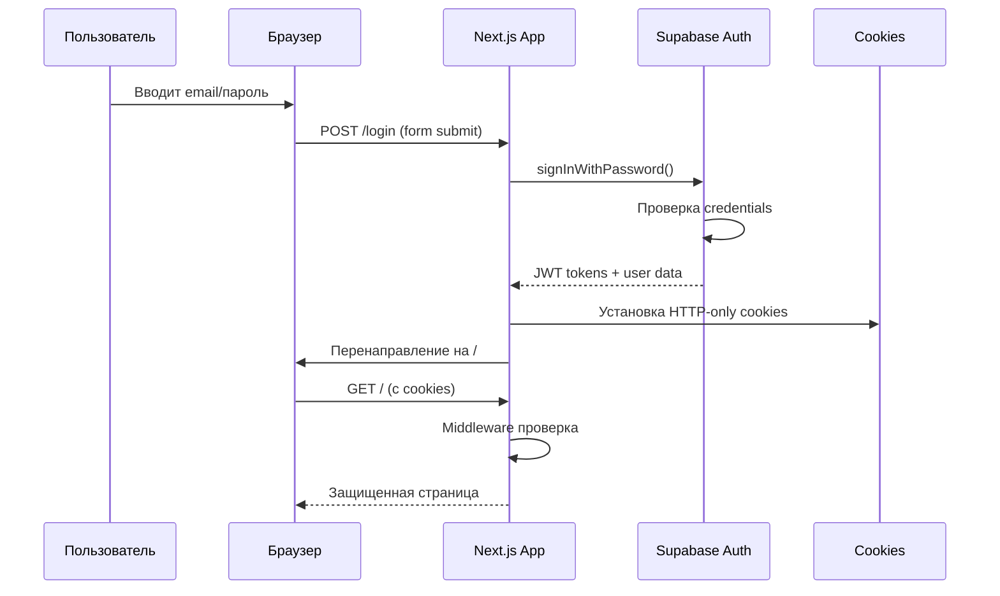
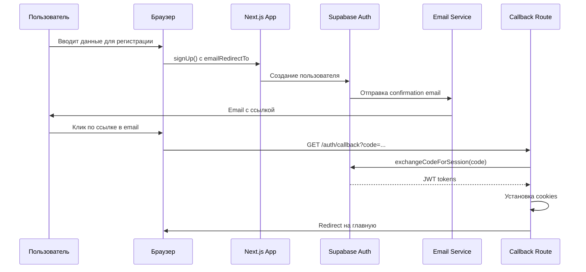
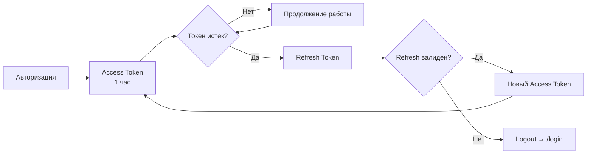
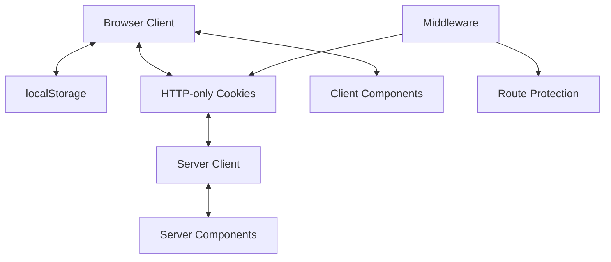
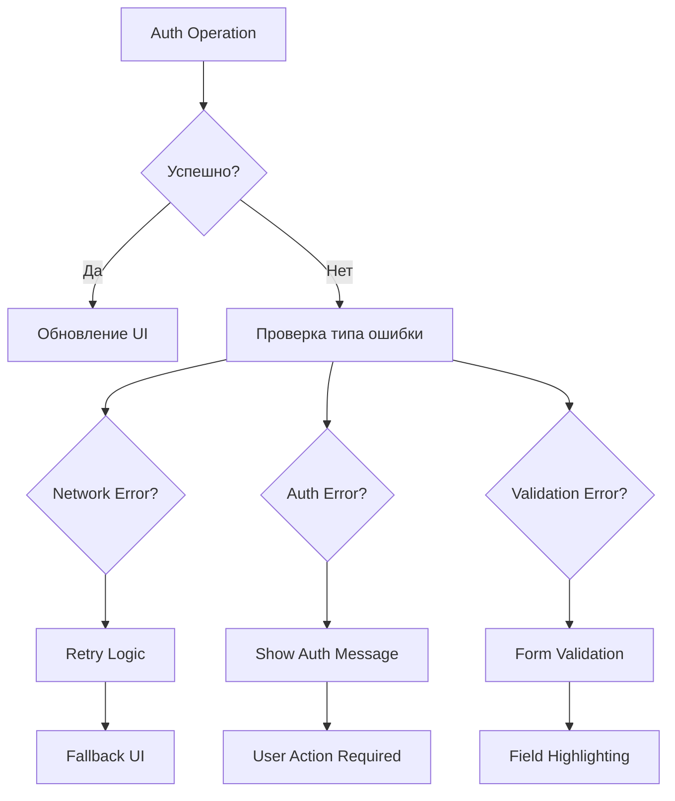
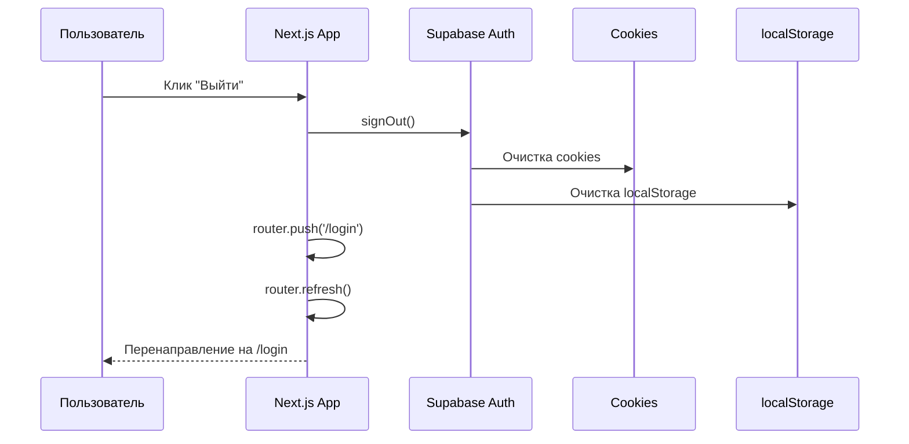

# 📊 Диаграммы потоков авторизации

## Общий поток авторизации

### 🔄 Полная схема системы

```mermaid
graph TB
    A[Пользователь] --> B[Браузер]
    B --> C[Next.js App]
    C --> D[Middleware]
    D --> E{Авторизован?}
    E -->|Да| F[Защищенные страницы]
    E -->|Нет| G[/login]
    G --> H[Supabase Auth]
    H --> I[JWT Tokens]
    I --> J[HTTP-only Cookies]
    J --> K[Успешная авторизация]
    K --> F
```

## 1. Процесс входа в систему (Sign In)

### Последовательная диаграмма



### Детальный поток

```
1. Пользователь открывает /login
   ↓
2. Вводит email и пароль
   ↓
3. handleAuth() в login/page.tsx
   ↓
4. supabase.auth.signInWithPassword()
   ↓
5. HTTP запрос к Supabase Auth API
   ↓
6. Supabase проверяет credentials в БД
   ↓
7. Создание JWT токенов (access + refresh)
   ↓
8. Browser client получает токены
   ↓
9. Автоматическая установка cookies
   ↓
10. router.push('/') + router.refresh()
    ↓
11. Middleware проверяет cookies
    ↓
12. Доступ к защищенным страницам
```

## 2. Процесс регистрации (Sign Up)

### Последовательная диаграмма



### Детальный поток регистрации

```
1. Пользователь выбирает "Зарегистрироваться"
   ↓
2. Вводит email и пароль
   ↓
3. handleAuth() с isSignUp=true
   ↓
4. supabase.auth.signUp() с emailRedirectTo
   ↓
5. Supabase создает пользователя (статус: unconfirmed)
   ↓
6. Отправка confirmation email
   ↓
7. Показ сообщения "Проверьте почту"
   ↓
8. Пользователь кликает ссылку в email
   ↓
9. Переход на /auth/callback?code=confirmation_code
   ↓
10. handleAuthCallback() обрабатывает код
    ↓
11. exchangeCodeForSession() создает сессию
    ↓
12. Установка cookies через server client
    ↓
13. Redirect на главную страницу
    ↓
14. Пользователь авторизован
```

## 3. Middleware Protection Flow

### Схема проверки доступа

```mermaid
graph TD
    A[Входящий запрос] --> B[Middleware]
    B --> C[Создание Server Client]
    C --> D[Чтение cookies]
    D --> E[supabase.auth.getUser()]
    E --> F{User существует?}
    F -->|Да| G{Защищенный роут?}
    F -->|Нет| H{Login/Auth роут?}
    H -->|Да| I[Пропустить]
    H -->|Нет| J[Redirect → /login]
    G -->|Да| K[Доступ разрешен]
    G -->|Нет| L[Публичный доступ]
```

### Алгоритм middleware

```typescript
// Упрощенная логика middleware
async function middleware(request) {
  // 1. Создание server client с cookies
  const supabase = createServerClient(/* ... */)
  
  // 2. Извлечение пользователя из токенов
  const { data: { user } } = await supabase.auth.getUser()
  
  // 3. Проверка доступа
  const isAuthRoute = pathname.startsWith('/login') || pathname.startsWith('/auth')
  const isProtected = !isAuthRoute
  
  // 4. Логика перенаправления
  if (!user && isProtected) {
    return NextResponse.redirect('/login')
  }
  
  // 5. Обновление cookies
  return supabaseResponse
}
```

## 4. Session Management Flow

### Жизненный цикл сессии



### Cookie Storage Structure

```
HTTP-only Cookies:
├── sb-[project-ref]-auth-token.0     # Часть 1 JWT (если большой)
├── sb-[project-ref]-auth-token.1     # Часть 2 JWT
└── sb-[project-ref]-auth-token       # Полный JWT (если помещается)

Параметры cookies:
├── httpOnly: true                    # Защита от XSS
├── secure: true                      # HTTPS only (production)
├── sameSite: 'lax'                   # CSRF protection
├── path: '/'                         # Доступны на всем сайте
└── maxAge: 3600                      # 1 час для access token
```

## 5. Client-Server Synchronization

### Синхронизация состояния



### Двунаправленная синхронизация

```
Browser Client                    Server Client
     ↓                                ↑
localStorage ←→ HTTP Cookies ←→ Server Components
     ↑                                ↓
Client Components              Middleware Check
```

## 6. Error Handling Flow

### Схема обработки ошибок



### Типы ошибок и реакции

| Тип ошибки | Код ошибки | Реакция системы |
|------------|------------|-----------------|
| **Invalid credentials** | 400 | Показать "Неверный email/пароль" |
| **Email not confirmed** | 400 | Показать "Подтвердите email" |
| **User not found** | 400 | Показать "Пользователь не найден" |
| **Network error** | 500/timeout | Retry + "Проблемы с сетью" |
| **Rate limit** | 429 | Показать "Слишком много попыток" |
| **Session expired** | 401 | Автоматический logout |

## 7. Logout Flow

### Процесс выхода



### Cleanup процесс

```
1. handleSignOut() в user-nav.tsx
   ↓
2. supabase.auth.signOut()
   ↓
3. Supabase SDK очищает:
   • HTTP-only cookies
   • localStorage tokens
   • Session state
   ↓
4. router.push('/login')
   ↓
5. router.refresh() - обновление server state
   ↓
6. Middleware перенаправляет неавторизованных
```

## 8. Real-time Auth State

### Подписка на изменения состояния

```typescript
// Автоматическая подписка в browser client
supabase.auth.onAuthStateChange((event, session) => {
  switch (event) {
    case 'SIGNED_IN':
      // Пользователь вошел
      router.refresh()
      break
    case 'SIGNED_OUT':
      // Пользователь вышел
      router.push('/login')
      break
    case 'TOKEN_REFRESHED':
      // Токен обновлен
      console.log('Token refreshed')
      break
  }
})
```

### События авторизации

```
SIGNED_IN     → Успешная авторизация
SIGNED_OUT    → Выход из системы
TOKEN_REFRESHED → Обновление access token
USER_UPDATED  → Изменение профиля пользователя
PASSWORD_RECOVERY → Восстановление пароля
```

---

*Диаграммы созданы с использованием Mermaid.js*
*Последнее обновление: ${new Date().toLocaleDateString('ru-RU')}*
